## Capstone 2 - SmartRecruit Case Study

### Problem Statement - How Can SmartRecruit Increase Customer Satisfaction Through Better Compensation

SmartRecruit is a recruitment agency with an objective of placing data scientists and engineers in best paying jobs based on their skills, education level and location. It’s been a challenge for recruiters to place the right candidate in the right location and compensation bracket due to a lack of data on market rates. This has led to a 60% decrease in customer satisfaction at SmartRecruit. We’ve been tasked to help drive up customer satisfaction by 40% in 6 months.  With the creation of a system (dashboard and analysis) that helps recruiters at SmartRecruit identify the prospective pay based on skills, education level and location from historical data in the United States. 


This analysis will aim to identify how the following variables correlated using the Data Science and Tech Salaries dataset:

<li> Compensation and education level  </li>
<li> Compensation and location </li>
<li> Compensation and age </li>
<li> Compensation and race  </li>
    

### Step 1: Import Relevant Libraries

First, we import libraries required from this analaysis. Some of these include the Pandas, MatPlotLib and Seaborn libraries 


```python
import matplotlib as mpl
import matplotlib.pyplot as plt 
plt.style.use('ggplot')
plt.rcParams["figure.figsize"] = (12,10) 
%matplotlib inline
import seaborn as sns
import pandas as pd
import csv
import statsmodels.api as sm
sns.set_style("darkgrid")
mpl.rcParams['figure.figsize'] = (20,5)
import numpy as np
```

### Step 2: Read Data

Next we pull in the required data. In this instance, the salary data is stored in a csv file. Also using the head, info and describe function clarifies how the data is structured. For example, from the info and shape function we see that the data has 29 columns and 62642 entries. 


```python
df = pd.read_csv(r"Levels_Fyi_Salary_Data.csv")
```


```python
df.head(20)
```


<div>
<style scoped>
    .dataframe tbody tr th:only-of-type {
        vertical-align: middle;
    }

    .dataframe tbody tr th {
        vertical-align: top;
    }

    .dataframe thead th {
        text-align: right;
    }
</style>
<table border="1" class="dataframe">
  <thead>
    <tr style="text-align: right;">
      <th></th>
      <th>timestamp</th>
      <th>company</th>
      <th>level</th>
      <th>title</th>
      <th>totalyearlycompensation</th>
      <th>location</th>
      <th>yearsofexperience</th>
      <th>yearsatcompany</th>
      <th>tag</th>
      <th>basesalary</th>
      <th>...</th>
      <th>Doctorate_Degree</th>
      <th>Highschool</th>
      <th>Some_College</th>
      <th>Race_Asian</th>
      <th>Race_White</th>
      <th>Race_Two_Or_More</th>
      <th>Race_Black</th>
      <th>Race_Hispanic</th>
      <th>Race</th>
      <th>Education</th>
    </tr>
  </thead>
  <tbody>
    <tr>
      <th>0</th>
      <td>6/7/2017 11:33:27</td>
      <td>Oracle</td>
      <td>L3</td>
      <td>Product Manager</td>
      <td>127000</td>
      <td>Redwood City, CA</td>
      <td>1.5</td>
      <td>1.5</td>
      <td>NaN</td>
      <td>107000.0</td>
      <td>...</td>
      <td>0</td>
      <td>0</td>
      <td>0</td>
      <td>0</td>
      <td>0</td>
      <td>0</td>
      <td>0</td>
      <td>0</td>
      <td>NaN</td>
      <td>NaN</td>
    </tr>
    <tr>
      <th>1</th>
      <td>6/10/2017 17:11:29</td>
      <td>eBay</td>
      <td>SE 2</td>
      <td>Software Engineer</td>
      <td>100000</td>
      <td>San Francisco, CA</td>
      <td>5.0</td>
      <td>3.0</td>
      <td>NaN</td>
      <td>0.0</td>
      <td>...</td>
      <td>0</td>
      <td>0</td>
      <td>0</td>
      <td>0</td>
      <td>0</td>
      <td>0</td>
      <td>0</td>
      <td>0</td>
      <td>NaN</td>
      <td>NaN</td>
    </tr>
    <tr>
      <th>2</th>
      <td>6/11/2017 14:53:57</td>
      <td>Amazon</td>
      <td>L7</td>
      <td>Product Manager</td>
      <td>310000</td>
      <td>Seattle, WA</td>
      <td>8.0</td>
      <td>0.0</td>
      <td>NaN</td>
      <td>155000.0</td>
      <td>...</td>
      <td>0</td>
      <td>0</td>
      <td>0</td>
      <td>0</td>
      <td>0</td>
      <td>0</td>
      <td>0</td>
      <td>0</td>
      <td>NaN</td>
      <td>NaN</td>
    </tr>
    <tr>
      <th>3</th>
      <td>6/17/2017 0:23:14</td>
      <td>Apple</td>
      <td>M1</td>
      <td>Software Engineering Manager</td>
      <td>372000</td>
      <td>Sunnyvale, CA</td>
      <td>7.0</td>
      <td>5.0</td>
      <td>NaN</td>
      <td>157000.0</td>
      <td>...</td>
      <td>0</td>
      <td>0</td>
      <td>0</td>
      <td>0</td>
      <td>0</td>
      <td>0</td>
      <td>0</td>
      <td>0</td>
      <td>NaN</td>
      <td>NaN</td>
    </tr>
    <tr>
      <th>4</th>
      <td>6/20/2017 10:58:51</td>
      <td>Microsoft</td>
      <td>60</td>
      <td>Software Engineer</td>
      <td>157000</td>
      <td>Mountain View, CA</td>
      <td>5.0</td>
      <td>3.0</td>
      <td>NaN</td>
      <td>0.0</td>
      <td>...</td>
      <td>0</td>
      <td>0</td>
      <td>0</td>
      <td>0</td>
      <td>0</td>
      <td>0</td>
      <td>0</td>
      <td>0</td>
      <td>NaN</td>
      <td>NaN</td>
    </tr>
    <tr>
      <th>5</th>
      <td>6/21/2017 17:27:47</td>
      <td>Microsoft</td>
      <td>63</td>
      <td>Software Engineer</td>
      <td>208000</td>
      <td>Seattle, WA</td>
      <td>8.5</td>
      <td>8.5</td>
      <td>NaN</td>
      <td>0.0</td>
      <td>...</td>
      <td>0</td>
      <td>0</td>
      <td>0</td>
      <td>0</td>
      <td>0</td>
      <td>0</td>
      <td>0</td>
      <td>0</td>
      <td>NaN</td>
      <td>NaN</td>
    </tr>
    <tr>
      <th>6</th>
      <td>6/22/2017 12:37:51</td>
      <td>Microsoft</td>
      <td>65</td>
      <td>Software Engineering Manager</td>
      <td>300000</td>
      <td>Redmond, WA</td>
      <td>15.0</td>
      <td>11.0</td>
      <td>NaN</td>
      <td>180000.0</td>
      <td>...</td>
      <td>0</td>
      <td>0</td>
      <td>0</td>
      <td>0</td>
      <td>0</td>
      <td>0</td>
      <td>0</td>
      <td>0</td>
      <td>NaN</td>
      <td>NaN</td>
    </tr>
    <tr>
      <th>7</th>
      <td>6/22/2017 13:55:26</td>
      <td>Microsoft</td>
      <td>62</td>
      <td>Software Engineer</td>
      <td>156000</td>
      <td>Seattle, WA</td>
      <td>4.0</td>
      <td>4.0</td>
      <td>NaN</td>
      <td>135000.0</td>
      <td>...</td>
      <td>0</td>
      <td>0</td>
      <td>0</td>
      <td>0</td>
      <td>0</td>
      <td>0</td>
      <td>0</td>
      <td>0</td>
      <td>NaN</td>
      <td>NaN</td>
    </tr>
    <tr>
      <th>8</th>
      <td>6/22/2017 23:08:16</td>
      <td>Microsoft</td>
      <td>59</td>
      <td>Software Engineer</td>
      <td>120000</td>
      <td>Redmond, WA</td>
      <td>3.0</td>
      <td>1.0</td>
      <td>NaN</td>
      <td>0.0</td>
      <td>...</td>
      <td>0</td>
      <td>0</td>
      <td>0</td>
      <td>0</td>
      <td>0</td>
      <td>0</td>
      <td>0</td>
      <td>0</td>
      <td>NaN</td>
      <td>NaN</td>
    </tr>
    <tr>
      <th>9</th>
      <td>6/26/2017 21:25:45</td>
      <td>Microsoft</td>
      <td>63</td>
      <td>Software Engineer</td>
      <td>201000</td>
      <td>Seattle, WA</td>
      <td>12.0</td>
      <td>6.0</td>
      <td>NaN</td>
      <td>157000.0</td>
      <td>...</td>
      <td>0</td>
      <td>0</td>
      <td>0</td>
      <td>0</td>
      <td>0</td>
      <td>0</td>
      <td>0</td>
      <td>0</td>
      <td>NaN</td>
      <td>NaN</td>
    </tr>
    <tr>
      <th>10</th>
      <td>6/30/2017 16:29:50</td>
      <td>Salesforce</td>
      <td>9</td>
      <td>Software Engineering Manager</td>
      <td>450000</td>
      <td>San Francisco, CA</td>
      <td>16.0</td>
      <td>3.0</td>
      <td>NaN</td>
      <td>230000.0</td>
      <td>...</td>
      <td>0</td>
      <td>0</td>
      <td>0</td>
      <td>0</td>
      <td>0</td>
      <td>0</td>
      <td>0</td>
      <td>0</td>
      <td>NaN</td>
      <td>NaN</td>
    </tr>
    <tr>
      <th>11</th>
      <td>7/2/2017 14:16:51</td>
      <td>Microsoft</td>
      <td>Sde 2</td>
      <td>Software Engineer</td>
      <td>155000</td>
      <td>Bellevue, WA</td>
      <td>5.0</td>
      <td>3.0</td>
      <td>NaN</td>
      <td>126000.0</td>
      <td>...</td>
      <td>0</td>
      <td>0</td>
      <td>0</td>
      <td>0</td>
      <td>0</td>
      <td>0</td>
      <td>0</td>
      <td>0</td>
      <td>NaN</td>
      <td>NaN</td>
    </tr>
    <tr>
      <th>12</th>
      <td>7/3/2017 19:28:09</td>
      <td>Microsoft</td>
      <td>63</td>
      <td>Product Manager</td>
      <td>150000</td>
      <td>Redmond, WA</td>
      <td>10.0</td>
      <td>10.0</td>
      <td>NaN</td>
      <td>0.0</td>
      <td>...</td>
      <td>0</td>
      <td>0</td>
      <td>0</td>
      <td>0</td>
      <td>0</td>
      <td>0</td>
      <td>0</td>
      <td>0</td>
      <td>NaN</td>
      <td>NaN</td>
    </tr>
    <tr>
      <th>13</th>
      <td>7/7/2017 22:29:34</td>
      <td>Microsoft</td>
      <td>63</td>
      <td>Software Engineer</td>
      <td>191000</td>
      <td>Seattle, WA</td>
      <td>7.0</td>
      <td>7.0</td>
      <td>NaN</td>
      <td>152000.0</td>
      <td>...</td>
      <td>0</td>
      <td>0</td>
      <td>0</td>
      <td>0</td>
      <td>0</td>
      <td>0</td>
      <td>0</td>
      <td>0</td>
      <td>NaN</td>
      <td>NaN</td>
    </tr>
    <tr>
      <th>14</th>
      <td>7/14/2017 21:36:15</td>
      <td>Amazon</td>
      <td>L6</td>
      <td>Software Engineering Manager</td>
      <td>287000</td>
      <td>Seattle, WA</td>
      <td>12.0</td>
      <td>1.0</td>
      <td>NaN</td>
      <td>160000.0</td>
      <td>...</td>
      <td>0</td>
      <td>0</td>
      <td>0</td>
      <td>0</td>
      <td>0</td>
      <td>0</td>
      <td>0</td>
      <td>0</td>
      <td>NaN</td>
      <td>NaN</td>
    </tr>
    <tr>
      <th>15</th>
      <td>7/16/2017 16:50:46</td>
      <td>Amazon</td>
      <td>L5</td>
      <td>Software Engineer</td>
      <td>218000</td>
      <td>Seattle, WA</td>
      <td>10.0</td>
      <td>0.0</td>
      <td>NaN</td>
      <td>150000.0</td>
      <td>...</td>
      <td>0</td>
      <td>0</td>
      <td>0</td>
      <td>0</td>
      <td>0</td>
      <td>0</td>
      <td>0</td>
      <td>0</td>
      <td>NaN</td>
      <td>NaN</td>
    </tr>
    <tr>
      <th>16</th>
      <td>7/20/2017 22:35:49</td>
      <td>Facebook</td>
      <td>E3</td>
      <td>Software Engineer</td>
      <td>168000</td>
      <td>Menlo Park, CA</td>
      <td>1.0</td>
      <td>1.0</td>
      <td>NaN</td>
      <td>0.0</td>
      <td>...</td>
      <td>0</td>
      <td>0</td>
      <td>0</td>
      <td>0</td>
      <td>0</td>
      <td>0</td>
      <td>0</td>
      <td>0</td>
      <td>NaN</td>
      <td>NaN</td>
    </tr>
    <tr>
      <th>17</th>
      <td>7/22/2017 22:20:17</td>
      <td>Uber</td>
      <td>5a</td>
      <td>Software Engineer</td>
      <td>160000</td>
      <td>San Francisco, CA</td>
      <td>9.0</td>
      <td>1.0</td>
      <td>NaN</td>
      <td>0.0</td>
      <td>...</td>
      <td>0</td>
      <td>0</td>
      <td>0</td>
      <td>0</td>
      <td>0</td>
      <td>0</td>
      <td>0</td>
      <td>0</td>
      <td>NaN</td>
      <td>NaN</td>
    </tr>
    <tr>
      <th>18</th>
      <td>7/24/2017 12:21:07</td>
      <td>Apple</td>
      <td>L4</td>
      <td>Software Engineer</td>
      <td>50000</td>
      <td>London, EN, United Kingdom</td>
      <td>2.0</td>
      <td>2.0</td>
      <td>NaN</td>
      <td>0.0</td>
      <td>...</td>
      <td>0</td>
      <td>0</td>
      <td>0</td>
      <td>0</td>
      <td>0</td>
      <td>0</td>
      <td>0</td>
      <td>0</td>
      <td>NaN</td>
      <td>NaN</td>
    </tr>
    <tr>
      <th>19</th>
      <td>7/24/2017 23:14:39</td>
      <td>Microsoft</td>
      <td>64</td>
      <td>Software Engineer</td>
      <td>195000</td>
      <td>Redmond, WA</td>
      <td>9.0</td>
      <td>9.0</td>
      <td>NaN</td>
      <td>0.0</td>
      <td>...</td>
      <td>0</td>
      <td>0</td>
      <td>0</td>
      <td>0</td>
      <td>0</td>
      <td>0</td>
      <td>0</td>
      <td>0</td>
      <td>NaN</td>
      <td>NaN</td>
    </tr>
  </tbody>
</table>
<p>20 rows × 29 columns</p>
</div>


```python
df.info()
```

    <class 'pandas.core.frame.DataFrame'>
    RangeIndex: 62642 entries, 0 to 62641
    Data columns (total 29 columns):
     #   Column                   Non-Null Count  Dtype  
    ---  ------                   --------------  -----  
     0   timestamp                62642 non-null  object 
     1   company                  62637 non-null  object 
     2   level                    62523 non-null  object 
     3   title                    62642 non-null  object 
     4   totalyearlycompensation  62642 non-null  int64  
     5   location                 62642 non-null  object 
     6   yearsofexperience        62642 non-null  float64
     7   yearsatcompany           62642 non-null  float64
     8   tag                      61788 non-null  object 
     9   basesalary               62642 non-null  float64
     10  stockgrantvalue          62642 non-null  float64
     11  bonus                    62642 non-null  float64
     12  gender                   43102 non-null  object 
     13  otherdetails             40137 non-null  object 
     14  cityid                   62642 non-null  int64  
     15  dmaid                    62640 non-null  float64
     16  rowNumber                62642 non-null  int64  
     17  Masters_Degree           62642 non-null  int64  
     18  Bachelors_Degree         62642 non-null  int64  
     19  Doctorate_Degree         62642 non-null  int64  
     20  Highschool               62642 non-null  int64  
     21  Some_College             62642 non-null  int64  
     22  Race_Asian               62642 non-null  int64  
     23  Race_White               62642 non-null  int64  
     24  Race_Two_Or_More         62642 non-null  int64  
     25  Race_Black               62642 non-null  int64  
     26  Race_Hispanic            62642 non-null  int64  
     27  Race                     22427 non-null  object 
     28  Education                30370 non-null  object 
    dtypes: float64(6), int64(13), object(10)
    memory usage: 13.9+ MB


```python
df.describe()
```


<div>
<style scoped>
    .dataframe tbody tr th:only-of-type {
        vertical-align: middle;
    }

    .dataframe tbody tr th {
        vertical-align: top;
    }

    .dataframe thead th {
        text-align: right;
    }
</style>
<table border="1" class="dataframe">
  <thead>
    <tr style="text-align: right;">
      <th></th>
      <th>totalyearlycompensation</th>
      <th>yearsofexperience</th>
      <th>yearsatcompany</th>
      <th>basesalary</th>
      <th>stockgrantvalue</th>
      <th>bonus</th>
      <th>cityid</th>
      <th>dmaid</th>
      <th>rowNumber</th>
      <th>Masters_Degree</th>
      <th>Bachelors_Degree</th>
      <th>Doctorate_Degree</th>
      <th>Highschool</th>
      <th>Some_College</th>
      <th>Race_Asian</th>
      <th>Race_White</th>
      <th>Race_Two_Or_More</th>
      <th>Race_Black</th>
      <th>Race_Hispanic</th>
    </tr>
  </thead>
  <tbody>
    <tr>
      <th>count</th>
      <td>6.264200e+04</td>
      <td>62642.000000</td>
      <td>62642.000000</td>
      <td>6.264200e+04</td>
      <td>6.264200e+04</td>
      <td>62642.000000</td>
      <td>62642.000000</td>
      <td>62640.000000</td>
      <td>62642.000000</td>
      <td>62642.000000</td>
      <td>62642.000000</td>
      <td>62642.000000</td>
      <td>62642.000000</td>
      <td>62642.000000</td>
      <td>62642.000000</td>
      <td>62642.000000</td>
      <td>62642.000000</td>
      <td>62642.000000</td>
      <td>62642.000000</td>
    </tr>
    <tr>
      <th>mean</th>
      <td>2.163004e+05</td>
      <td>7.204135</td>
      <td>2.702093</td>
      <td>1.366873e+05</td>
      <td>5.148608e+04</td>
      <td>19334.746588</td>
      <td>9856.201989</td>
      <td>616.097222</td>
      <td>41694.723732</td>
      <td>0.245698</td>
      <td>0.201223</td>
      <td>0.028783</td>
      <td>0.005108</td>
      <td>0.005667</td>
      <td>0.187925</td>
      <td>0.128221</td>
      <td>0.012835</td>
      <td>0.011015</td>
      <td>0.018039</td>
    </tr>
    <tr>
      <th>std</th>
      <td>1.380337e+05</td>
      <td>5.840375</td>
      <td>3.263656</td>
      <td>6.136928e+04</td>
      <td>8.187457e+04</td>
      <td>26781.292040</td>
      <td>6679.104563</td>
      <td>289.843390</td>
      <td>24488.865879</td>
      <td>0.430504</td>
      <td>0.400917</td>
      <td>0.167196</td>
      <td>0.071291</td>
      <td>0.075067</td>
      <td>0.390655</td>
      <td>0.334338</td>
      <td>0.112562</td>
      <td>0.104373</td>
      <td>0.133094</td>
    </tr>
    <tr>
      <th>min</th>
      <td>1.000000e+04</td>
      <td>0.000000</td>
      <td>0.000000</td>
      <td>0.000000e+00</td>
      <td>0.000000e+00</td>
      <td>0.000000</td>
      <td>0.000000</td>
      <td>0.000000</td>
      <td>1.000000</td>
      <td>0.000000</td>
      <td>0.000000</td>
      <td>0.000000</td>
      <td>0.000000</td>
      <td>0.000000</td>
      <td>0.000000</td>
      <td>0.000000</td>
      <td>0.000000</td>
      <td>0.000000</td>
      <td>0.000000</td>
    </tr>
    <tr>
      <th>25%</th>
      <td>1.350000e+05</td>
      <td>3.000000</td>
      <td>0.000000</td>
      <td>1.080000e+05</td>
      <td>0.000000e+00</td>
      <td>1000.000000</td>
      <td>7369.000000</td>
      <td>506.000000</td>
      <td>20069.250000</td>
      <td>0.000000</td>
      <td>0.000000</td>
      <td>0.000000</td>
      <td>0.000000</td>
      <td>0.000000</td>
      <td>0.000000</td>
      <td>0.000000</td>
      <td>0.000000</td>
      <td>0.000000</td>
      <td>0.000000</td>
    </tr>
    <tr>
      <th>50%</th>
      <td>1.880000e+05</td>
      <td>6.000000</td>
      <td>2.000000</td>
      <td>1.400000e+05</td>
      <td>2.500000e+04</td>
      <td>14000.000000</td>
      <td>7839.000000</td>
      <td>807.000000</td>
      <td>42019.000000</td>
      <td>0.000000</td>
      <td>0.000000</td>
      <td>0.000000</td>
      <td>0.000000</td>
      <td>0.000000</td>
      <td>0.000000</td>
      <td>0.000000</td>
      <td>0.000000</td>
      <td>0.000000</td>
      <td>0.000000</td>
    </tr>
    <tr>
      <th>75%</th>
      <td>2.640000e+05</td>
      <td>10.000000</td>
      <td>4.000000</td>
      <td>1.700000e+05</td>
      <td>6.500000e+04</td>
      <td>26000.000000</td>
      <td>11521.000000</td>
      <td>807.000000</td>
      <td>63021.750000</td>
      <td>0.000000</td>
      <td>0.000000</td>
      <td>0.000000</td>
      <td>0.000000</td>
      <td>0.000000</td>
      <td>0.000000</td>
      <td>0.000000</td>
      <td>0.000000</td>
      <td>0.000000</td>
      <td>0.000000</td>
    </tr>
    <tr>
      <th>max</th>
      <td>4.980000e+06</td>
      <td>69.000000</td>
      <td>69.000000</td>
      <td>1.659870e+06</td>
      <td>2.800000e+06</td>
      <td>1000000.000000</td>
      <td>47926.000000</td>
      <td>881.000000</td>
      <td>83875.000000</td>
      <td>1.000000</td>
      <td>1.000000</td>
      <td>1.000000</td>
      <td>1.000000</td>
      <td>1.000000</td>
      <td>1.000000</td>
      <td>1.000000</td>
      <td>1.000000</td>
      <td>1.000000</td>
      <td>1.000000</td>
    </tr>
  </tbody>
</table>
</div>


```python
df.shape
```


    (62642, 29)


### Step 3: Clean Data

Some of the columns provided in the salary data set will be irrelevant to our analysis. Also we will only be focusing on Job roles SmartRecruit places cliets in which are mainly software engineering and data science related roles. In this step, we will remove columns and job roles that are not needed.


<li>List of columns in original dataset</li>


```python
list(df.columns)
```


    ['timestamp',
     'company',
     'level',
     'title',
     'totalyearlycompensation',
     'location',
     'yearsofexperience',
     'yearsatcompany',
     'tag',
     'basesalary',
     'stockgrantvalue',
     'bonus',
     'gender',
     'otherdetails',
     'cityid',
     'dmaid',
     'rowNumber',
     'Masters_Degree',
     'Bachelors_Degree',
     'Doctorate_Degree',
     'Highschool',
     'Some_College',
     'Race_Asian',
     'Race_White',
     'Race_Two_Or_More',
     'Race_Black',
     'Race_Hispanic',
     'Race',
     'Education']


<li>Drop List of Columns to required columns for analysis </li>


```python
df = df[['company', 'title', 'totalyearlycompensation','location','yearsofexperience', 'yearsatcompany','basesalary','gender','Race', 'Education']]

df
```


<div>
<style scoped>
    .dataframe tbody tr th:only-of-type {
        vertical-align: middle;
    }

    .dataframe tbody tr th {
        vertical-align: top;
    }

    .dataframe thead th {
        text-align: right;
    }
</style>
<table border="1" class="dataframe">
  <thead>
    <tr style="text-align: right;">
      <th></th>
      <th>company</th>
      <th>title</th>
      <th>totalyearlycompensation</th>
      <th>location</th>
      <th>yearsofexperience</th>
      <th>yearsatcompany</th>
      <th>basesalary</th>
      <th>gender</th>
      <th>Race</th>
      <th>Education</th>
    </tr>
  </thead>
  <tbody>
    <tr>
      <th>0</th>
      <td>Oracle</td>
      <td>Product Manager</td>
      <td>127000</td>
      <td>Redwood City, CA</td>
      <td>1.5</td>
      <td>1.5</td>
      <td>107000.0</td>
      <td>NaN</td>
      <td>NaN</td>
      <td>NaN</td>
    </tr>
    <tr>
      <th>1</th>
      <td>eBay</td>
      <td>Software Engineer</td>
      <td>100000</td>
      <td>San Francisco, CA</td>
      <td>5.0</td>
      <td>3.0</td>
      <td>0.0</td>
      <td>NaN</td>
      <td>NaN</td>
      <td>NaN</td>
    </tr>
    <tr>
      <th>2</th>
      <td>Amazon</td>
      <td>Product Manager</td>
      <td>310000</td>
      <td>Seattle, WA</td>
      <td>8.0</td>
      <td>0.0</td>
      <td>155000.0</td>
      <td>NaN</td>
      <td>NaN</td>
      <td>NaN</td>
    </tr>
    <tr>
      <th>3</th>
      <td>Apple</td>
      <td>Software Engineering Manager</td>
      <td>372000</td>
      <td>Sunnyvale, CA</td>
      <td>7.0</td>
      <td>5.0</td>
      <td>157000.0</td>
      <td>NaN</td>
      <td>NaN</td>
      <td>NaN</td>
    </tr>
    <tr>
      <th>4</th>
      <td>Microsoft</td>
      <td>Software Engineer</td>
      <td>157000</td>
      <td>Mountain View, CA</td>
      <td>5.0</td>
      <td>3.0</td>
      <td>0.0</td>
      <td>NaN</td>
      <td>NaN</td>
      <td>NaN</td>
    </tr>
    <tr>
      <th>...</th>
      <td>...</td>
      <td>...</td>
      <td>...</td>
      <td>...</td>
      <td>...</td>
      <td>...</td>
      <td>...</td>
      <td>...</td>
      <td>...</td>
      <td>...</td>
    </tr>
    <tr>
      <th>62637</th>
      <td>Google</td>
      <td>Software Engineer</td>
      <td>327000</td>
      <td>Seattle, WA</td>
      <td>10.0</td>
      <td>1.0</td>
      <td>155000.0</td>
      <td>NaN</td>
      <td>NaN</td>
      <td>NaN</td>
    </tr>
    <tr>
      <th>62638</th>
      <td>Microsoft</td>
      <td>Software Engineer</td>
      <td>237000</td>
      <td>Redmond, WA</td>
      <td>2.0</td>
      <td>2.0</td>
      <td>146900.0</td>
      <td>NaN</td>
      <td>NaN</td>
      <td>NaN</td>
    </tr>
    <tr>
      <th>62639</th>
      <td>MSFT</td>
      <td>Software Engineer</td>
      <td>220000</td>
      <td>Seattle, WA</td>
      <td>14.0</td>
      <td>12.0</td>
      <td>157000.0</td>
      <td>NaN</td>
      <td>NaN</td>
      <td>NaN</td>
    </tr>
    <tr>
      <th>62640</th>
      <td>Salesforce</td>
      <td>Software Engineer</td>
      <td>280000</td>
      <td>San Francisco, CA</td>
      <td>8.0</td>
      <td>4.0</td>
      <td>194688.0</td>
      <td>NaN</td>
      <td>NaN</td>
      <td>NaN</td>
    </tr>
    <tr>
      <th>62641</th>
      <td>apple</td>
      <td>Software Engineer</td>
      <td>200000</td>
      <td>Sunnyvale, CA</td>
      <td>0.0</td>
      <td>0.0</td>
      <td>155000.0</td>
      <td>Male</td>
      <td>NaN</td>
      <td>NaN</td>
    </tr>
  </tbody>
</table>
<p>62642 rows × 10 columns</p>
</div>


<li>List of required columns</li>


```python
list(df.columns)
```


    ['company',
     'title',
     'totalyearlycompensation',
     'location',
     'yearsofexperience',
     'yearsatcompany',
     'basesalary',
     'gender',
     'Race',
     'Education']


```python
undesired_titles = ['Marketing', 'Mechanical Engineer', 'Sales', 'Recruiter', 'Human Resources']
df_original = df.copy()
df = df[df['title'].apply(lambda x: x not in undesired_titles)]
df.title.value_counts()
```


    Software Engineer               41231
    Product Manager                  4673
    Software Engineering Manager     3569
    Data Scientist                   2578
    Hardware Engineer                2200
    Product Designer                 1516
    Technical Program Manager        1381
    Solution Architect               1157
    Management Consultant             976
    Business Analyst                  885
    Name: title, dtype: int64


```python
undesired_locations = ['* Hungary', '* Nigeria', '* India', 'Bangladesh','Oulu, OU, Finland']
df_original = df.copy()
df = df[df['location'].apply(lambda x: x not in undesired_locations)]
df.location.value_counts()
```


    Seattle, WA                              8397
    San Francisco, CA                        6445
    New York, NY                             4366
    Redmond, WA                              2602
    Mountain View, CA                        2206
                                             ... 
    Rialto, CA                                  1
    Oldsmar, FL                                 1
    Philipsburg, SM, Netherlands Antilles       1
    Sammamish, WA                               1
    Hilbert, WI                                 1
    Name: location, Length: 1009, dtype: int64


```python
df.shape
```


    (60166, 10)


```python
df.dtypes
```


    company                     object
    title                       object
    totalyearlycompensation      int64
    location                    object
    yearsofexperience          float64
    yearsatcompany             float64
    basesalary                 float64
    gender                      object
    Race                        object
    Education                   object
    dtype: object


```python
print(df.shape)
df.isnull().sum()
```

    (60166, 10)


    company                        5
    title                          0
    totalyearlycompensation        0
    location                       0
    yearsofexperience              0
    yearsatcompany                 0
    basesalary                     0
    gender                     18552
    Race                       39006
    Education                  31244
    dtype: int64


```python
df.info()
```

    <class 'pandas.core.frame.DataFrame'>
    Int64Index: 60166 entries, 0 to 62641
    Data columns (total 10 columns):
     #   Column                   Non-Null Count  Dtype  
    ---  ------                   --------------  -----  
     0   company                  60161 non-null  object 
     1   title                    60166 non-null  object 
     2   totalyearlycompensation  60166 non-null  int64  
     3   location                 60166 non-null  object 
     4   yearsofexperience        60166 non-null  float64
     5   yearsatcompany           60166 non-null  float64
     6   basesalary               60166 non-null  float64
     7   gender                   41614 non-null  object 
     8   Race                     21160 non-null  object 
     9   Education                28922 non-null  object 
    dtypes: float64(3), int64(1), object(6)
    memory usage: 5.0+ MB


```python
null_df = pd.DataFrame(df.isnull().sum(), columns = ['Count of Nulls'])
null_df.index.name = 'Column Name'
null_df[null_df ['Count of Nulls'] > 0].sort_values('Count of Nulls', ascending=False)
```


<div>
<style scoped>
    .dataframe tbody tr th:only-of-type {
        vertical-align: middle;
    }

    .dataframe tbody tr th {
        vertical-align: top;
    }

    .dataframe thead th {
        text-align: right;
    }
</style>
<table border="1" class="dataframe">
  <thead>
    <tr style="text-align: right;">
      <th></th>
      <th>Count of Nulls</th>
    </tr>
    <tr>
      <th>Column Name</th>
      <th></th>
    </tr>
  </thead>
  <tbody>
    <tr>
      <th>Race</th>
      <td>39006</td>
    </tr>
    <tr>
      <th>Education</th>
      <td>31244</td>
    </tr>
    <tr>
      <th>gender</th>
      <td>18552</td>
    </tr>
    <tr>
      <th>company</th>
      <td>5</td>
    </tr>
  </tbody>
</table>
</div>


```python
df = df.fillna({'company':'Unknown', 'gender':'Unknown','Race': 'Unknown', 'Education': 'Unknown'})
df
```


<div>
<style scoped>
    .dataframe tbody tr th:only-of-type {
        vertical-align: middle;
    }

    .dataframe tbody tr th {
        vertical-align: top;
    }

    .dataframe thead th {
        text-align: right;
    }
</style>
<table border="1" class="dataframe">
  <thead>
    <tr style="text-align: right;">
      <th></th>
      <th>company</th>
      <th>title</th>
      <th>totalyearlycompensation</th>
      <th>location</th>
      <th>yearsofexperience</th>
      <th>yearsatcompany</th>
      <th>basesalary</th>
      <th>gender</th>
      <th>Race</th>
      <th>Education</th>
    </tr>
  </thead>
  <tbody>
    <tr>
      <th>0</th>
      <td>Oracle</td>
      <td>Product Manager</td>
      <td>127000</td>
      <td>Redwood City, CA</td>
      <td>1.5</td>
      <td>1.5</td>
      <td>107000.0</td>
      <td>Unknown</td>
      <td>Unknown</td>
      <td>Unknown</td>
    </tr>
    <tr>
      <th>1</th>
      <td>eBay</td>
      <td>Software Engineer</td>
      <td>100000</td>
      <td>San Francisco, CA</td>
      <td>5.0</td>
      <td>3.0</td>
      <td>0.0</td>
      <td>Unknown</td>
      <td>Unknown</td>
      <td>Unknown</td>
    </tr>
    <tr>
      <th>2</th>
      <td>Amazon</td>
      <td>Product Manager</td>
      <td>310000</td>
      <td>Seattle, WA</td>
      <td>8.0</td>
      <td>0.0</td>
      <td>155000.0</td>
      <td>Unknown</td>
      <td>Unknown</td>
      <td>Unknown</td>
    </tr>
    <tr>
      <th>3</th>
      <td>Apple</td>
      <td>Software Engineering Manager</td>
      <td>372000</td>
      <td>Sunnyvale, CA</td>
      <td>7.0</td>
      <td>5.0</td>
      <td>157000.0</td>
      <td>Unknown</td>
      <td>Unknown</td>
      <td>Unknown</td>
    </tr>
    <tr>
      <th>4</th>
      <td>Microsoft</td>
      <td>Software Engineer</td>
      <td>157000</td>
      <td>Mountain View, CA</td>
      <td>5.0</td>
      <td>3.0</td>
      <td>0.0</td>
      <td>Unknown</td>
      <td>Unknown</td>
      <td>Unknown</td>
    </tr>
    <tr>
      <th>...</th>
      <td>...</td>
      <td>...</td>
      <td>...</td>
      <td>...</td>
      <td>...</td>
      <td>...</td>
      <td>...</td>
      <td>...</td>
      <td>...</td>
      <td>...</td>
    </tr>
    <tr>
      <th>62637</th>
      <td>Google</td>
      <td>Software Engineer</td>
      <td>327000</td>
      <td>Seattle, WA</td>
      <td>10.0</td>
      <td>1.0</td>
      <td>155000.0</td>
      <td>Unknown</td>
      <td>Unknown</td>
      <td>Unknown</td>
    </tr>
    <tr>
      <th>62638</th>
      <td>Microsoft</td>
      <td>Software Engineer</td>
      <td>237000</td>
      <td>Redmond, WA</td>
      <td>2.0</td>
      <td>2.0</td>
      <td>146900.0</td>
      <td>Unknown</td>
      <td>Unknown</td>
      <td>Unknown</td>
    </tr>
    <tr>
      <th>62639</th>
      <td>MSFT</td>
      <td>Software Engineer</td>
      <td>220000</td>
      <td>Seattle, WA</td>
      <td>14.0</td>
      <td>12.0</td>
      <td>157000.0</td>
      <td>Unknown</td>
      <td>Unknown</td>
      <td>Unknown</td>
    </tr>
    <tr>
      <th>62640</th>
      <td>Salesforce</td>
      <td>Software Engineer</td>
      <td>280000</td>
      <td>San Francisco, CA</td>
      <td>8.0</td>
      <td>4.0</td>
      <td>194688.0</td>
      <td>Unknown</td>
      <td>Unknown</td>
      <td>Unknown</td>
    </tr>
    <tr>
      <th>62641</th>
      <td>apple</td>
      <td>Software Engineer</td>
      <td>200000</td>
      <td>Sunnyvale, CA</td>
      <td>0.0</td>
      <td>0.0</td>
      <td>155000.0</td>
      <td>Male</td>
      <td>Unknown</td>
      <td>Unknown</td>
    </tr>
  </tbody>
</table>
<p>60166 rows × 10 columns</p>
</div>


```python
print(df.shape)
df.isnull().sum()
```

    (60166, 10)


    company                    0
    title                      0
    totalyearlycompensation    0
    location                   0
    yearsofexperience          0
    yearsatcompany             0
    basesalary                 0
    gender                     0
    Race                       0
    Education                  0
    dtype: int64


### Step 4: Analyze Data

Now that the data has been cleaned and arrange in a way that works best for our objectives, we now start analyzing the data.

The first analysis is looking into what roles ghave the highest Average yearly total compensation. From the analysis we find that the role with highest average yearly compesation is <b>Software Engineering Manager </b> followed closely by <b>Product Manager</b>


```python
job_titles = df[['company','title', 'totalyearlycompensation']].groupby(['title']).mean().round(2).sort_values('totalyearlycompensation',ascending = True)
fig, ax = plt.subplots(figsize=(12, 8))
# horizontal barplot with barh()
ax.barh(job_titles.index, job_titles.totalyearlycompensation)
labels = ax.get_xticklabels()
plt.setp(labels, 
         rotation=45, 
         horizontalalignment='right')
ax.set(xlabel='Avg Yearly Compensation', 
       ylabel='Title',
       title='Avg Yearly Compensation By Role')
ax.xaxis.set_major_formatter('${x:1,.0f}')
```


    
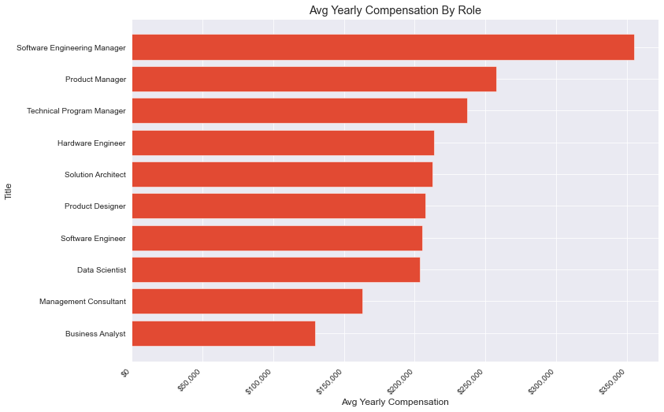
    


Base Salary is Total compensation minus equity and other employee benefits. It is total of the cash payment an employee receives yearly. 


Looking at Base Salary compared with roles, Though <b> Software Engineering Manager </b> has the highest base salary, <b>Technical Program Managers</b> seem to get paid a higher base salary than <b> Product Managers</b>. This is an interesting inisght as total compesation is higher for <b>Product Managers</b>


```python
job_titles = df[['company','title', 'basesalary']].groupby(['title']).mean().round(2).sort_values('basesalary',ascending = True)
fig, ax = plt.subplots(figsize=(12, 8))
# horizontal barplot with barh()
ax.barh(job_titles.index, job_titles.basesalary)
labels = ax.get_xticklabels()
plt.setp(labels, 
         rotation=45, 
         horizontalalignment='right')
ax.set(xlabel='Avg Base Salary', 
       ylabel='Title',
       title='Avg Yearly Base By Role')
ax.xaxis.set_major_formatter('${x:1,.0f}')
```


    
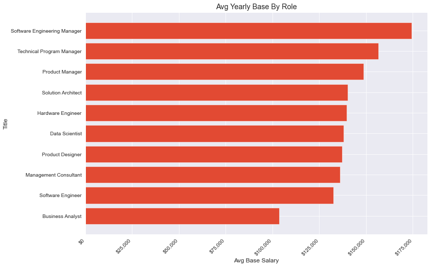
    


The chart below shows the distribution of workers represented in the dataset for each role. <b>Software engineers</b> has the highest number of employees in the dataset.


```python
top_jobs = df['title'].value_counts(ascending = True)
top_jobs.plot.barh(figsize = (12,8))
plt.title("Number of Workers in Each Job Role From Dataset", size=17)
plt.xlabel('Number of Workers', size = 15)
plt.ylabel('Job Title', size = 15)
plt.show();
```


    
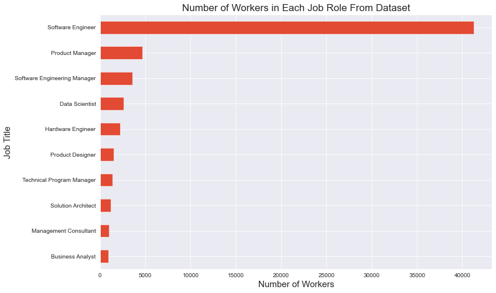
    


What companies pay the highest compensation? The analysis below shows that ,<b>Facebook</b>, followed closely by <b>Micorsoft</b> pays the highest compensation 


```python

highest_paying_companies = df[['company','title','totalyearlycompensation']].groupby(['company']).max().sort_values('totalyearlycompensation',ascending = False).head(10).sort_values('totalyearlycompensation', ascending = True).plot.barh(figsize = (12,8), legend = False);

plt.title('Top 10 Companies With highest compensation', size=17)
plt.xlabel('Compensation in Millions ($)', size = 15)
plt.ylabel('Company', size = 15)
plt.show();
```


    
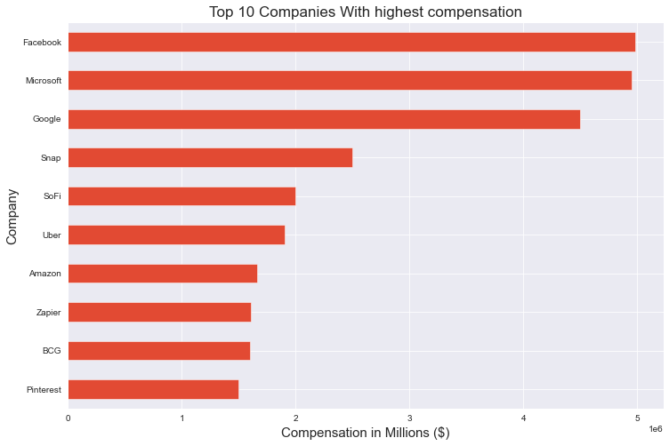
    


Looking at how compensation compares with Gender, there are more men represented in the datasets. Men are most compnesated.


```python
df['gender'].unique()
```


    array(['Unknown', 'Male', 'Female', 'Other',
           'Title: Senior Software Engineer'], dtype=object)


```python
df['gender'] = df['gender'].replace('Title: Senior Software Engineer', 'Unknown')
df['gender'].unique()
```


    array(['Unknown', 'Male', 'Female', 'Other'], dtype=object)


```python
pay_by_gender = df[['totalyearlycompensation', 'gender']].groupby(['gender']).mean().round(2).sort_values('totalyearlycompensation', ascending = False).head(10).sort_values('totalyearlycompensation', ascending = True).plot.barh(figsize = (12,8), legend = False);

plt.title('Compensation by Gender', size=20)
plt.xlabel('Compensation($)', size = 15)
plt.ylabel('Gender', size = 15)
plt.show();
```


    
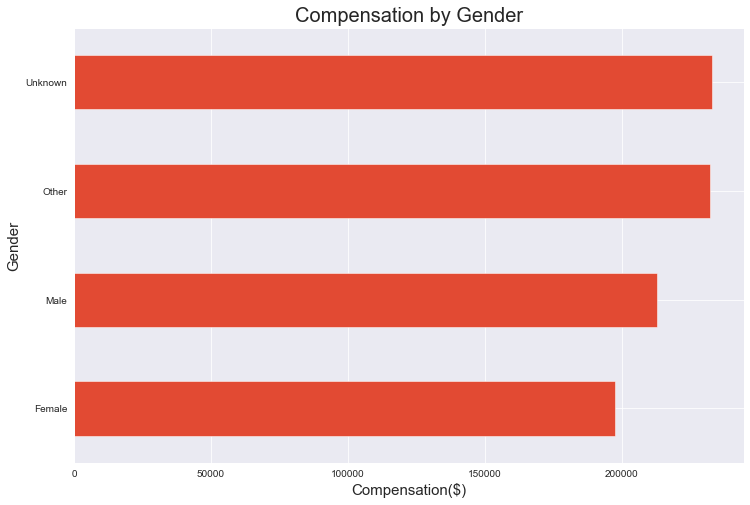
    


```python
gender_distribution = df['gender'].value_counts(ascending = True).plot.barh(figsize = (12,8));
plt.title('Gender Distribution', size=20)
plt.xlabel('Count', size = 15)
plt.ylabel('Gender', size = 15)
plt.show();
```


    
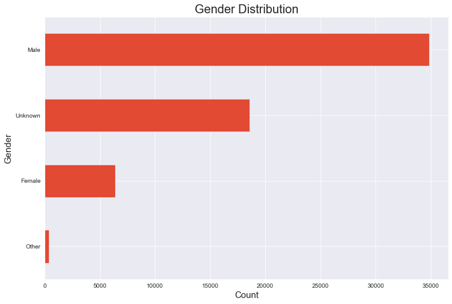
    


Comparing Compensation to race, White are compensated more. 


```python
pay_by_race = df[['totalyearlycompensation','Race']].groupby(['Race'])\
                                                               .mean()\
                                                               .round(2)\
                                                               .sort_values('totalyearlycompensation', ascending = True)\
                                                               .plot.barh(figsize = (12,8), legend = False)
plt.title('Compensation By Race', size=20)
plt.xlabel('Compensation ($)', size = 15)
plt.ylabel('Race', size = 15)
plt.show();
```


    
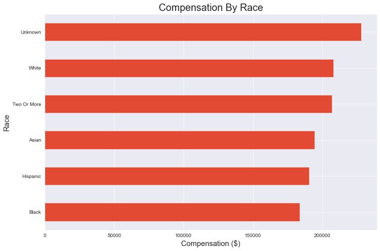
    


```python
race_distribution = df['Race'].value_counts().plot.pie(figsize = (12,10),label = 'Race', autopct='%.0f%%',radius=1,shadow=True);
plt.title('Race Distribution', size=20)
plt.show();
```


    
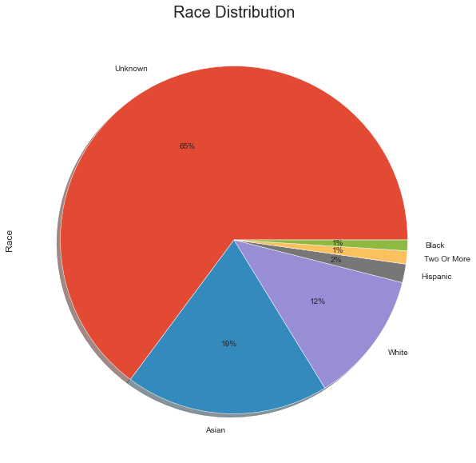
    


Comparing Compensation to Education level, employees with PhD are compensated more. 


```python
pay_by_education = df[['totalyearlycompensation','Education']].groupby(['Education'])\
                                                                         .mean().round()\
                                                                         .sort_values('totalyearlycompensation', ascending = True)\
                                                                         .plot.barh(figsize = (12,8), legend = False)
plt.title('Compensation By Education', size=20)
plt.xlabel('Compensation ($)', size = 15)
plt.ylabel('Education', size = 15)
plt.show();
```


    
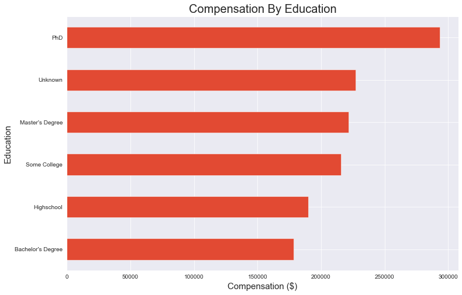
    


```python
education_distribution = df['Education'].value_counts(ascending = True).plot.barh(figsize = (12,8))
plt.title('Distribution of Education', size=20)
plt.xlabel('Count', size = 15)
plt.ylabel('Education', size = 15)
plt.show();
```


    
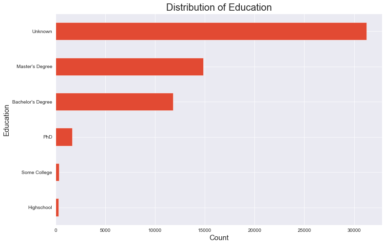
    


Comparing Compensation to years of experience,  there does not seem to be a correlation. 


```python
years_of_experience = df[['totalyearlycompensation','yearsofexperience']].groupby(['yearsofexperience'])\
                                                                                             .mean()\
                                                                                             .round(2)\
                                                                                             .sort_values('totalyearlycompensation', ascending = False)\
                                                                                             .head(10)\
                                                                                             .sort_values('yearsofexperience', ascending = True)\
                                                                                             .plot.barh(figsize = (12,8),legend = False )
plt.title('Years of Experience VS Compensation', size=17)
plt.xlabel('Compensation ($)', size = 15)
plt.ylabel('Years of Experience', size = 15)
plt.show();
```


    
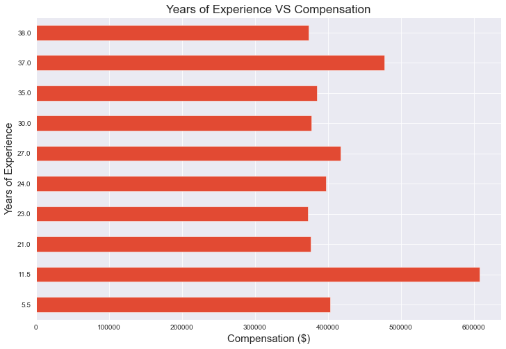
    


Looking at Compensation and Location, Most tech jobs represented in this data set are in located in <b>Seattle</b> and  <b>San Franscisco</b>. However the highest average yearly compensation are not in this location.


```python
location = df['location'].value_counts(ascending = False).head(10).sort_values(ascending = True).plot.barh(figsize = (15,8))
plt.title('Top 10 locations of tech jobs', size=17)
plt.xlabel('Number of workers', size = 15)
plt.ylabel('Company', size = 15)
plt.show();
```


    
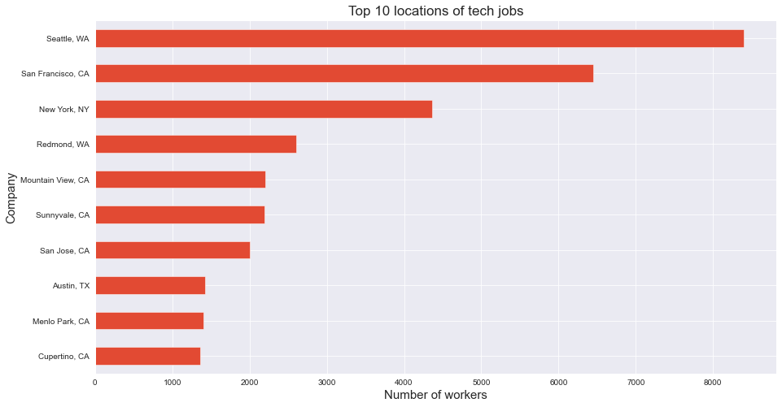
    


```python
job_titles = df[['company','location', 'totalyearlycompensation']].groupby(['location']).mean().round(2).sort_values('totalyearlycompensation',ascending = False).head(20)
fig, ax = plt.subplots(figsize=(12, 8))
# horizontal barplot with barh()
ax.barh(job_titles.index, job_titles.totalyearlycompensation)
labels = ax.get_xticklabels()
plt.setp(labels, 
         rotation=45, 
         horizontalalignment='right')
ax.set(xlabel='Avg Yearly Compensation', 
       ylabel='Location',
       title='Avg Yearly Compensation By Location')
ax.xaxis.set_major_formatter('${x:1,.0f}')
```


    
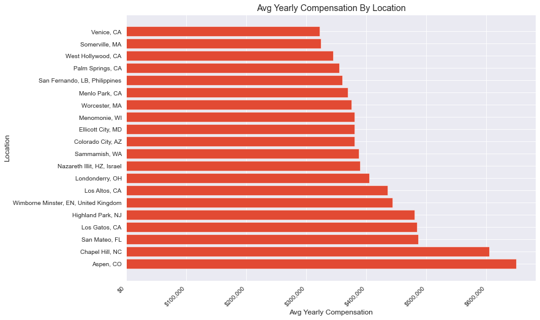
    


```python

```
